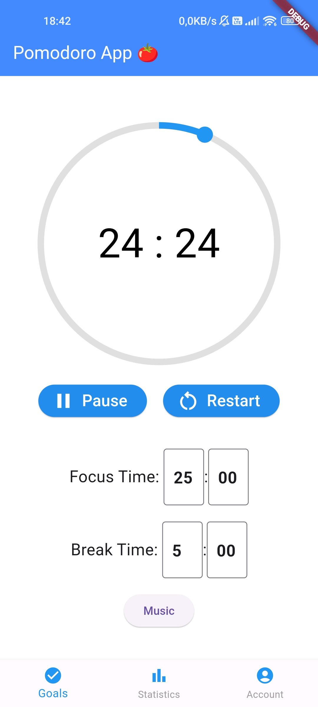
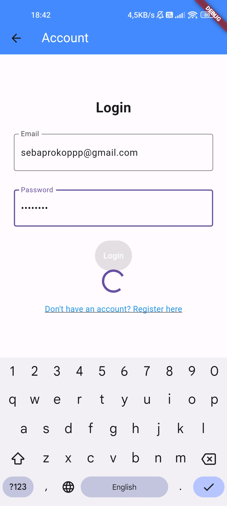
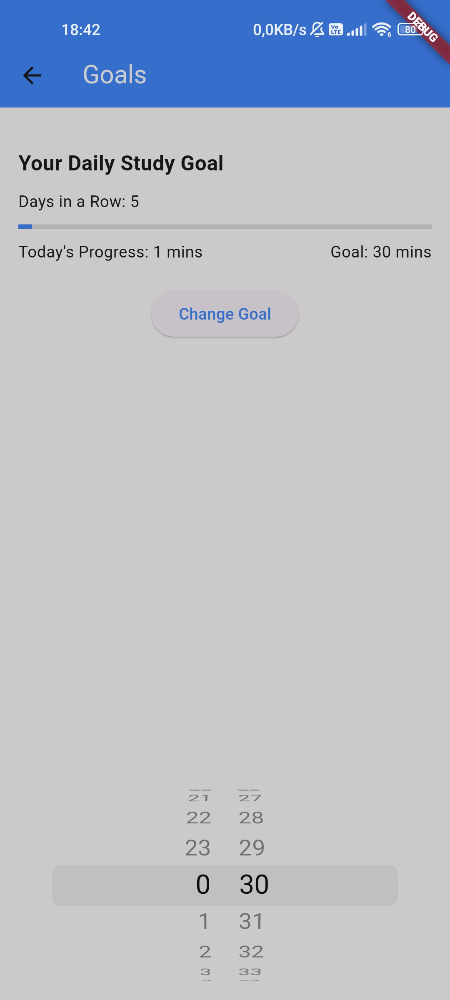
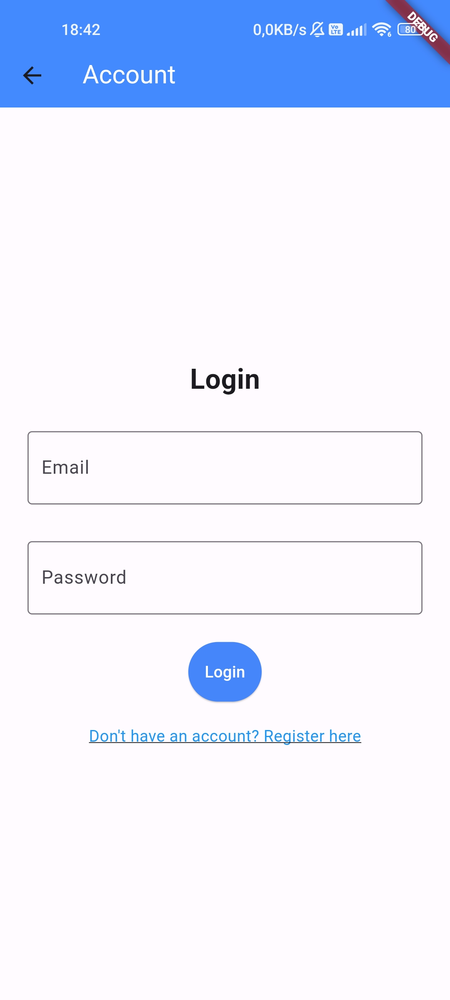
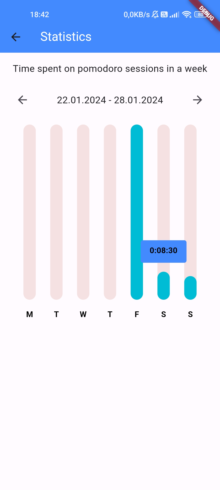
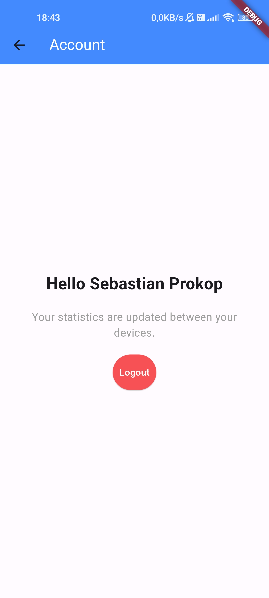

# Pomodoro App

Pomodoro App is a productivity application that helps users manage their focus and time efficiently. It incorporates the Pomodoro Technique, allowing users to work in focused sessions with short breaks, enhancing productivity.

## Features

- **Pomodoro Timer**: Start focused sessions with customizable work and break durations.
- **Statistics**: Track your time spent on sessions over the week with interactive charts.
- **Account Management**: Create an account to synchronize data across devices.
- **Goal Setting**: Set daily or weekly goals for focused sessions and track your progress.

## Screenshots

  
  
  
  
  
  
  

